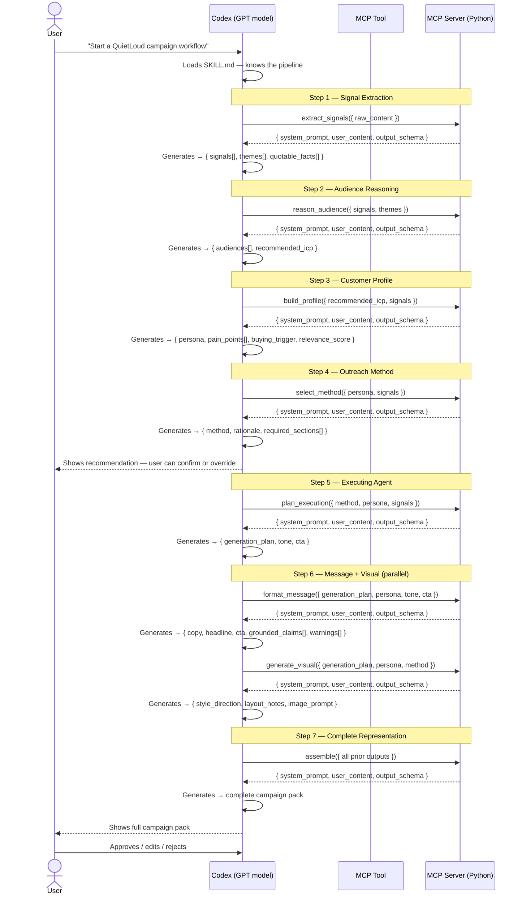
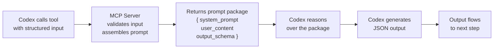
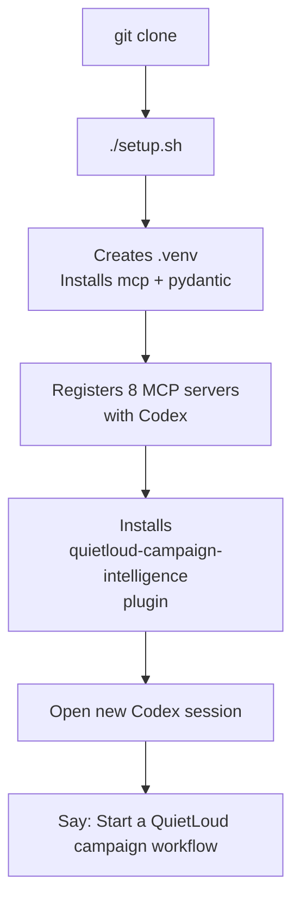

# QuietLoud Campaign Intelligence — How It Runs in Codex

## Full Pipeline Flow

---

## What Each MCP Server Actually Does

> The MCP servers are **prompt assemblers**, not AI agents. No API key needed — all reasoning happens inside Codex.

---

## Install Once, Use Forever

