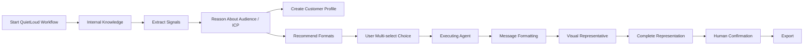

# QuietLoud Campaign Intelligence - Workflow

Codex workflow plugin that turns internal project knowledge and external market signals into validated personas, campaign angles, outreach methods, and complete campaign representations.

## Current Product Hypothesis

QuietLoud has useful marketing signals scattered across project notes, Confluence pages, Teams discussions, wiki content, and external market context. The Codex plugin extracts those signals, reasons about targetable customer profiles, chooses the right outreach or asset method, generates written and visual outputs, and gates everything through human confirmation.

## Primary Mermaid Workflow

```mermaid
flowchart LR
    S[Start Workflow<br/>Start workflow for QuietLoud in Codex] --> A[Input Layer<br/>Confluence, mocked Teams, wiki, web search]
    A --> B[Signal Extraction<br/>What happened? What data exists? What did we learn? What can we do?]
    A --> A1[Source Connectors<br/>MCP Teams mock, Confluence straw, Tavily web search]
    B --> C[Audience Reasoning<br/>Internal, external, HR, startups, marketing, CRO]
    C --> D[Customer Profile<br/>Persona, pain, buying trigger, relevance score]
    C --> E[ICP Agent<br/>Validate fit against QuietLoud target profiles]
    C --> F[Recommended Formats<br/>Snippet, LinkedIn, email, FAQ, website block, visual asset]
    E --> F
    F --> U[User Format Selection<br/>Multi-select formats to generate]
    U --> G[Executing Agent<br/>Plan selected channel outputs]
    U --> R[Optional Reference Image<br/>Style or example image]
    G --> H[Message Formatting<br/>Format message, bullets, CTA]
    H --> I[Visual Representative Generation<br/>Use message, bullets, CTA, format, reference image]
    R --> I
    I --> I1[Codex Image Gen<br/>Attachment image or exact prompt explaining the message]
    H --> J[Complete Representation<br/>Profile, selected formats, copy, visual representative, validation notes]
    I1 --> J
    D --> J
    J --> K[Human Confirmation<br/>Approve, edit, or reject]
    K --> L[Export<br/>Website preview, LinkedIn draft, HubSpot note, campaign handoff]
```

## Compact Flow

## MVP Boundary

For the hackathon demo, build the QuietLoud direction as a Codex workflow plugin. Use pasted or sample Confluence/project content, mock Teams, and optional web search enrichment. Do not depend on live LinkedIn, HubSpot, Teams, Confluence, or website publishing.

The output should be a complete campaign representation:

- customer profile
- recommended outreach or asset methods
- user-selected formats
- message asset
- visual representative attachment or image prompt
- CTA
- claim-validation notes
- human confirmation status

## Workflow Roles

These are workflow roles, not necessarily persistent runtime agents:

- Signal Extraction Agent
- ICP Reasoning Agent
- Outreach Strategy Agent
- Message Formatting Agent
- Graphical Pipeline Agent
- Validation Agent

Image generation is one optional output branch inside the graphical pipeline. It is not the final destination of the full workflow. When selected, it must create a representative attachment image or exact image prompt that explains the generated post/text with the message, bullets, CTA, and optional reference image.

## Interactive Checkpoint

Before message formatting and graphical generation, the workflow must ask the user which formats to generate. This should be a multi-select step.

Initial options:

- outreach snippet
- mailing/email
- FAQ
- website block
- LinkedIn draft
- visual asset
- HubSpot note
- sales talking points

If a visual asset, LinkedIn draft, website block, or other visual-capable format is selected, ask for an optional reference image or style direction before visual representative generation.

## Visual Representative Requirement

The final visual step must not produce a generic decorative image. It must produce one of:

- a generated attachment image, if image generation is live
- an exact image-generation prompt, if image generation is mocked

The visual must represent the selected asset's message. For example, for a LinkedIn post, the output should include the post text, key bullets, CTA, and a matching attachment image or image prompt that explains the concept visually.

## Viability Paths

| Path | Description | Viability | Recommendation |
|---|---|---|---|
| Confluence/project knowledge to campaign representation | Use internal project knowledge to generate persona, selected formats, message assets, representative visuals, and validation notes | High | Build this for the hackathon |
| Persona enrichment | Find marketing personas and enrich HubSpot for targeting | Medium | Future path; requires reliable CRM/persona data |
| Broad internal knowledge publisher | Teams, Confluence, docs to website-ready assets | Medium-high | Strong later direction, but keep sources narrow for demo |
| LinkedIn-led outbound | Find audiences and generate outreach from LinkedIn signals | Low for MVP | Avoid scraping and platform risk |
